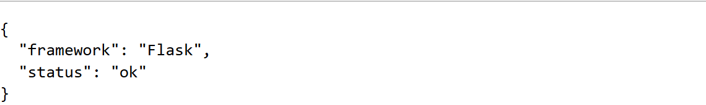
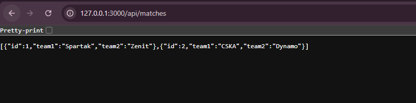
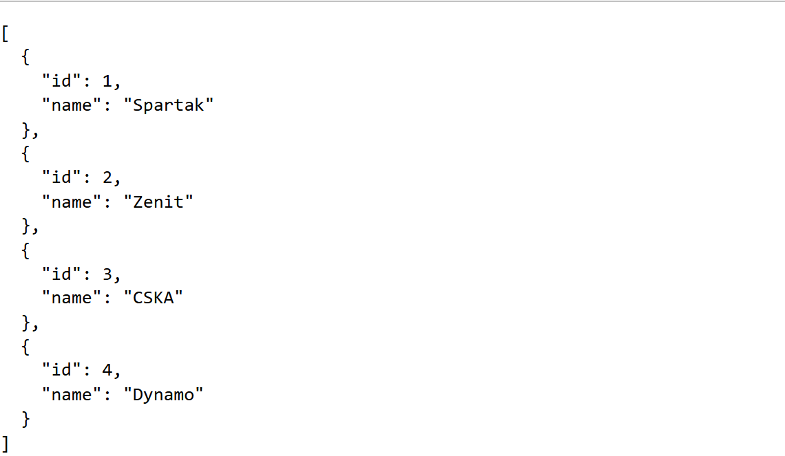
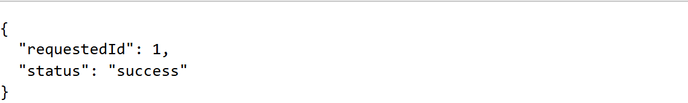
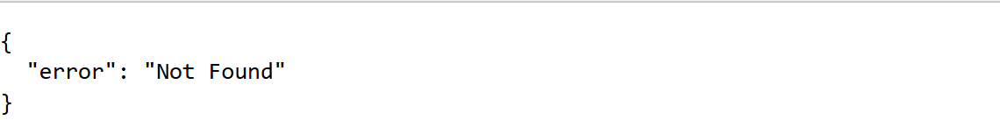

# Лабораторная работа №1

## Настройка среды разработки и первый HTTP-сервер

**Студент:** Зорькин Арсений Станиславович  
**Группа:** ПИЖ-б-о-25-2(1)  
**Вариант:** 12  
**Технология:** Python + Flask

**Дисциплина:** Введение в бэкенд разработку  
**Университет:** Северо-Кавказский федеральный университет  
**Институт:** Институт перспективной инженерии  
**Направление:** 09.03.04 «Программная инженерия»  
**Проверяющий:** Новикова Елена Николаевна  
**Место и год:** Ставрополь, 2026

## Содержание

- [1 Цель работы](#1-цель-работы)
- [2 Теоретическое обоснование](#2-теоретическое-обоснование)
- [3 Выполнение практического примера](#3-выполнение-практического-примера)
- [4 Выполнение индивидуального задания](#4-выполнение-индивидуального-задания)
- [5 Ответы на контрольные вопросы](#5-ответы-на-контрольные-вопросы)
- [6 Вывод](#6-вывод)
- [7 Список использованных источников](#7-список-использованных-источников)

## 1 Цель работы

Создать и запустить HTTP-сервер на Python с использованием Flask. Освоить обработку GET-запросов, возврат текста и JSON, получение параметра из пути, обработку ошибки 404, логирование запросов и автоматический перезапуск при изменении кода.

## 2 Теоретическое обоснование

Бэкенд - серверная часть приложения, которая принимает запросы клиента и формирует ответы. Клиентом может быть браузер или программа curl. В работе используется Python и веб-фреймворк Flask. Декоратор @app.route() связывает адрес с функцией, которая обрабатывает запрос. Эндпоинт определяется HTTP-методом и адресом, например GET /api/matches.

HTTP - протокол взаимодействия клиента и сервера. Метод GET предназначен для получения данных. Код ответа 200 означает успешную обработку, а 404 - отсутствие ресурса. JSON - текстовый формат обмена данными, поддерживающий объекты, массивы, строки, числа, логические значения и null. Во Flask функция jsonify() формирует JSON-ответ из объектов Python.

Параметр `<int:match_id>` позволяет получить целое число из URL и передать его функции. Обработчик @app.errorhandler(404) задаёт собственный ответ для ошибки 404. Функция с декоратором @app.before_request выполняется перед обработкой запроса; здесь она выводит журнал. Режим debug=True включает автоматический перезапуск при изменениях исходного кода. Вкладку браузера после изменения нужно обновить отдельно.

## 3 Выполнение практического примера

### 3.1 Подготовка среды

В исходном отчёте указаны Python 3.12.14 и Flask 3.1.3. В локальном окружении проекта установлены Python 3.14.2 и Flask 3.1.3. Для подготовки окружения выполнить команды PowerShell:

```powershell
python -m venv .venv
.\.venv\Scripts\python.exe -m pip install -r requirements.txt
.\.venv\Scripts\python.exe example.py
```

Файл requirements.txt содержит Flask==3.1.3. Активация окружения не требуется, поскольку указан путь к его интерпретатору. Учебный пример доступен по адресу http://127.0.0.1:3001/. Остановка сервера - Ctrl+C.

### 3.2 Код практического примера

Минимальный пример демонстрирует текстовый ответ и JSON-ответ со статусом приложения.

Файл example.py:

```python
from flask import Flask, jsonify
 
app = Flask(__name__)
 
 
@app.route('/')
def home():
    return 'Hello, server works!'
 
 
@app.route('/api/status')
def status():
    return jsonify({"status": "ok", "framework": "Flask"})
 
 
if __name__ == '__main__':
    app.run(port=3001, debug=True)
```

### 3.3 Проверка примера

```powershell
curl.exe -i http://127.0.0.1:3001/
curl.exe -i http://127.0.0.1:3001/api/status
```

В исходном отчёте приведены следующие снимки ответов практического примера: текстовое приветствие и JSON со статусом приложения.


*Рисунок 1 - Практический пример GET / возвращает приветствие*



*Рисунок 2 - Практический пример GET /api/status возвращает JSON*

## 4 Выполнение индивидуального задания

### 4.1 Условие варианта 12

Повышенный уровень: реализовать текстовый ответ на /, коллекции матчей /api/matches и команд /api/teams, параметризованный маршрут /api/matches/:id, JSON-обработчик 404, журнал запросов и автоматический перезапуск. Для параметризованного маршрута методичка допускает ответ с подтверждением полученного ID.

### 4.2 Код сервера

Реализованы два учебных матча: Spartak - Zenit и CSKA - Dynamo. В отдельном списке содержатся четыре команды. Эти данные заданы непосредственно в коде и не являются результатами реальных соревнований.

Файл app.py:

```python
from flask import Flask, jsonify,request
import time

app = Flask(__name__)

@app.route('/')
def home():
    return 'Hello, server works!'
@app.route('/api/matches')
def matches():
    return jsonify([
        {"id": 1, "team1": "Spartak", "team2": "Zenit"},
        {"id": 2, "team1": "CSKA", "team2": "Dynamo"}
    ])
@app.route('/api/teams')
def teams():
    return jsonify([
        {"id": 1, "name": "Spartak"},
        {"id": 2, "name": "Zenit"},
        {"id": 3, "name": "CSKA"},
        {"id": 4, "name": "Dynamo"}
    ])
@app.route('/api/matches/<int:match_id>')
def match_by_id(match_id):
    return jsonify({
        "requestedId": match_id,
        "status": "success"
    })
@app.errorhandler(404)
def page_not_found(error):
    return jsonify({
        "error": "Not Found"
    }), 404
@app.before_request
def log_request():
    print(f"[{time.strftime('%Y-%m-%d %H:%M:%S')}] {request.method} {request.path}")
app.run(port=3000)
if __name__ == '__main__':
    app.run(port=3000, debug=True)
```

### 4.3 Запуск и объяснение

В другом терминале из папки проекта выполнить:

```powershell
.\.venv\Scripts\python.exe app.py
```

Сервер запускается на http://127.0.0.1:3000/. В текущем app.py имеются два вызова app.run(). Первый, app.run(port=3000), запускает сервер без режима отладки и блокирует выполнение следующего блока до остановки. Поэтому при обычном запуске автоматический перезапуск не включён. Исходный код сохранён без изменений.

Функция home() возвращает строку Hello, server works!. Функции matches() и teams() передают списки словарей в jsonify(). По умолчанию строковый ответ Flask имеет тип text/html, а ответ jsonify() - application/json.

В маршруте `/api/matches/<int:match_id>` Flask преобразует числовой сегмент пути в int. Функция match_by_id() возвращает requestedId и status: success. Поиск существующего матча здесь не выполняется: например, ID 999 также получает подтверждение и статус 200. Это соответствует разрешённому в методичке упрощённому решению.

Если адрес неизвестен или сегмент не подходит целочисленному конвертеру, например /api/matches/abc, срабатывает page_not_found(). Она возвращает JSON {"error":"Not Found"} и настоящий HTTP-код 404 через кортеж (ответ, 404).

Декоратор @app.before_request регистрирует log_request(). Функция выводит локальное время, request.method и request.path. Она выполняется и для неизвестных адресов; возвращать из неё ответ не требуется. request.path содержит путь без параметров строки запроса.

### 4.4 Результаты работы всех эндпоинтов

```powershell
curl.exe -i http://127.0.0.1:3000/
curl.exe -i http://127.0.0.1:3000/api/matches
curl.exe -i http://127.0.0.1:3000/api/teams
curl.exe -i http://127.0.0.1:3000/api/matches/1
curl.exe -i http://127.0.0.1:3000/anything-else
```

На изображениях из исходного отчёта показана работа всех требуемых обработчиков. Повторная проверка текущего app.py подтвердила HTTP 200 для /, /api/matches, /api/teams и /api/matches/5, а также HTTP 404 для /anything-else.


*Рисунок 3 - GET / возвращает текстовый ответ*



*Рисунок 4 - GET /api/matches возвращает два матча*



*Рисунок 5 - GET /api/teams возвращает четыре команды*



*Рисунок 6 - GET /api/matches/1 подтверждает получение ID*



*Рисунок 7 - GET /anything-else возвращает JSON с HTTP 404*

### 4.5 Логирование и перезапуск

При повторной проверке текущего app.py получены следующие записи:

```text
[2026-09-20 14:08:29] GET /
[2026-09-20 14:08:29] GET /
[2026-09-20 14:08:29] GET /api/matches
[2026-09-20 14:08:29] GET /api/teams
[2026-09-20 14:08:29] GET /api/matches/5
[2026-09-20 14:08:29] GET /anything-else
```

Логирование метода, пути и времени подтверждено. В текущем файле первый вызов app.run(port=3000) запускает сервер с сообщением Debug mode: off. Поэтому автоматический перезапуск для этой версии не подтверждён. Сведения об успешной проверке перезапуска в исходном Word-отчёте относятся к другой версии кода, где предварительный вызов app.run() отсутствует.

## 5 Ответы на контрольные вопросы

### 5.1 Как устроены HTTP запрос и ответ

В HTTP/1.1 запрос содержит стартовую строку с методом, целью запроса и версией, затем заголовки, пустую строку и необязательное тело. Ответ содержит строку статуса, заголовки, пустую строку и тело, когда оно предусмотрено. Код состояния сообщает результат обработки; например, 200 означает успех, а 404 - отсутствие ресурса.

### 5.2 Как запустить сервер Flask и включить перезапуск

Для запуска установленного приложения выполнить python app.py из окружения с Flask. В общем случае app.run(port=3000, debug=True) включает режим отладки и автоматический перезапуск. Однако в текущем app.py этот вызов расположен после блокирующего app.run(port=3000), поэтому обычный запуск сначала работает без перезапуска.

### 5.3 Что означает ошибка 404 и как вернуть её в JSON

404 означает, что запрошенный ресурс не найден. Декоратор @app.errorhandler(404) регистрирует обработчик. Возврат jsonify({"error": "Not Found"}), 404 одновременно задаёт тело JSON и код состояния. Если вернуть только JSON без числа 404, по умолчанию ответ получит код 200.

### 5.4 Для чего нужны декораторы запросов во Flask

@app.route() регистрирует маршрут, @app.before_request - функцию перед обработкой запроса, а @app.errorhandler() - обработчик ошибки. В работе функция before_request выводит время, метод и путь в консоль. Если она ничего не возвращает, Flask продолжает обычную обработку.

### 5.5 Как получить параметр из URL

Нужно указать переменную часть пути: `/api/matches/<int:match_id>`. Flask проверит формат и передаст match_id функции как целое число. Например, при /api/matches/5 параметр равен 5. В данной работе он помещается в поле requestedId JSON-ответа.

## 6 Вывод

Создан сервер варианта 12 на Python и Flask: реализованы текстовый ответ, две JSON-коллекции, подтверждение параметра ID, обработчик 404 и журналирование. Проверены ответы требуемых маршрутов и запись запросов в консоль. Работа демонстрирует декораторы маршрутов, формирование JSON и передачу параметра пути в функцию. Автоматический перезапуск в текущей версии не включён из-за предварительного вызова app.run(port=3000).

## 7 Список использованных источников

1. Лабораторная работа №1 «Настройка среды разработки и первый HTTP-сервер». Предоставленная методичка: вариант 12 и допустимое подтверждение ID - с. 10; требования к отчёту - с. 11-12.

2. Flask. Quickstart. Маршруты, параметры и режим отладки. <https://flask.palletsprojects.com/en/stable/quickstart/>

3. Flask. API. jsonify, before_request и обработчики ошибок. <https://flask.palletsprojects.com/en/stable/api/>

4. RFC 9110. HTTP Semantics. <https://www.rfc-editor.org/rfc/rfc9110.html>

5. RFC 8259. Формат JSON. <https://www.rfc-editor.org/rfc/rfc8259.html>
