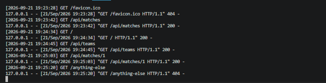

# Лабораторная работа №1

## Настройка среды разработки и первый HTTP-сервер

**Студент:** Зорькин Арсений Станиславович  
**Группа:** ПИЖ-б-о-25-2(1)  
**Вариант:** 12  
**Технология:** Python + Flask

**Дисциплина:** Введение в бэкенд разработку  
**Университет:** Северо-Кавказский федеральный университет  
**Институт:** Институт перспективной инженерии  
**Направление:** 09.03.04 «Программная инженерия»  
**Проверяющий:** Новикова Елена Николаевна  
**Место и год:** Ставрополь, 2026

## Содержание

- [1 Цель работы](#1-цель-работы)
- [2 Теоретическое обоснование](#2-теоретическое-обоснование)
- [3 Выполнение практического примера](#3-выполнение-практического-примера)
- [4 Выполнение индивидуального задания](#4-выполнение-индивидуального-задания)
- [5 Ответы на контрольные вопросы](#5-ответы-на-контрольные-вопросы)
- [6 Вывод](#6-вывод)
- [7 Список использованных источников](#7-список-использованных-источников)

## 1 Цель работы

Создать и запустить HTTP-сервер на Python с использованием Flask. Освоить обработку GET-запросов, возврат текста и JSON, получение параметра из пути, обработку ошибки 404, логирование запросов и автоматический перезапуск при изменении кода.

## 2 Теоретическое обоснование

Бэкенд - серверная часть приложения, которая принимает запросы клиента и формирует ответы. Клиентом может быть браузер или программа curl. В работе используется Python и веб-фреймворк Flask. Декоратор @app.route() связывает адрес с функцией, которая обрабатывает запрос. Эндпоинт определяется HTTP-методом и адресом, например GET /api/matches.

HTTP - протокол взаимодействия клиента и сервера. Метод GET предназначен для получения данных. Код ответа 200 означает успешную обработку, а 404 - отсутствие ресурса. JSON - текстовый формат обмена данными, поддерживающий объекты, массивы, строки, числа, логические значения и null. Во Flask функция jsonify() формирует JSON-ответ из объектов Python.

Параметр `<int:match_id>` позволяет получить целое число из URL и передать его функции. Обработчик @app.errorhandler(404) задаёт собственный ответ для ошибки 404. Функция с декоратором @app.before_request выполняется перед обработкой запроса; здесь она выводит журнал. Режим debug=True включает автоматический перезапуск при изменениях исходного кода. Вкладку браузера после изменения нужно обновить отдельно.

## 3 Выполнение практического примера

### 3.1 Подготовка среды

Для работы использованы Python 3.14.2 и Flask 3.1.3. Команды для создания окружения и запуска примера в PowerShell:

```powershell
python -m venv .venv
.\.venv\Scripts\python.exe -m pip install -r requirements.txt
.\.venv\Scripts\python.exe example.py
```

Файл requirements.txt содержит Flask==3.1.3. Активация окружения не требуется, поскольку указан путь к его интерпретатору. Учебный пример доступен по адресу http://127.0.0.1:3001/. Остановка сервера - Ctrl+C.

### 3.2 Код практического примера

Минимальный пример демонстрирует текстовый ответ и JSON-ответ со статусом приложения.

Файл example.py:

```python
from flask import Flask, jsonify
 
app = Flask(__name__)
 
 
@app.route('/')
def home():
    return 'Hello, server works!'
 
 
@app.route('/api/status')
def status():
    return jsonify({"status": "ok", "framework": "Flask"})
 
 
if __name__ == '__main__':
    app.run(port=3001, debug=True)
```

### 3.3 Проверка примера

```powershell
curl.exe -i http://127.0.0.1:3001/
curl.exe -i http://127.0.0.1:3001/api/status
```

На рисунках 1 и 2 показаны ответы практического примера: приветствие и JSON со статусом сервера.


*Рисунок 1 - Практический пример GET / возвращает приветствие*


*Рисунок 2 - Практический пример GET /api/status возвращает JSON*

## 4 Выполнение индивидуального задания

### 4.1 Условие варианта 12

Повышенный уровень: реализовать текстовый ответ на /, коллекции матчей /api/matches и команд /api/teams, параметризованный маршрут /api/matches/:id, JSON-обработчик 404, журнал запросов и автоматический перезапуск. Для параметризованного маршрута методичка допускает ответ с подтверждением полученного ID.

### 4.2 Код сервера

В списке матчей заданы две пары команд: Spartak - Zenit и CSKA - Dynamo. Маршрут `/api/teams` возвращает список этих четырёх команд. Данные хранятся в коде, база данных не используется.

Файл app.py:

```python
from flask import Flask, jsonify,request
import time

app = Flask(__name__)

@app.route('/')
def home():
    return 'Hello, server works!'
@app.route('/api/matches')
def matches():
    return jsonify([
        {"id": 1, "team1": "Spartak", "team2": "Zenit"},
        {"id": 2, "team1": "CSKA", "team2": "Dynamo"}
    ])
@app.route('/api/teams')
def teams():
    return jsonify([
        {"id": 1, "name": "Spartak"},
        {"id": 2, "name": "Zenit"},
        {"id": 3, "name": "CSKA"},
        {"id": 4, "name": "Dynamo"}
    ])
@app.route('/api/matches/<int:match_id>')
def match_by_id(match_id):
    return jsonify({
        "requestedId": match_id,
        "status": "success"
    })
@app.errorhandler(404)
def page_not_found(error):
    return jsonify({
        "error": "Not Found"
    }), 404
@app.before_request
def log_request():
    print(f"[{time.strftime('%Y-%m-%d %H:%M:%S')}] {request.method} {request.path}")
app.run(port=3000)
if __name__ == '__main__':
    app.run(port=3000, debug=True)
```

### 4.3 Запуск и объяснение

В другом терминале из папки проекта выполнить:

```powershell
.\.venv\Scripts\python.exe app.py
```

Сервер доступен по адресу http://127.0.0.1:3000/.

Функция home() возвращает строку Hello, server works!. Функции matches() и teams() передают списки словарей в jsonify(). По умолчанию строковый ответ Flask имеет тип text/html, а ответ jsonify() - application/json.

Маршрут `/api/matches/<int:match_id>` принимает целочисленный ID и возвращает его в поле `requestedId` вместе со статусом `success`. Наличие матча в списке не проверяется. Например, запрос с ID 999 тоже возвращает подтверждение. Такой ответ допускается условием задания.

При запросе неизвестного адреса вызывается `page_not_found()`. Функция возвращает JSON `{"error":"Not Found"}` и код HTTP 404. Этот же обработчик срабатывает для `/api/matches/abc`, поскольку `abc` не подходит параметру типа `int`.

Функция `log_request()` вызывается перед обработкой каждого запроса благодаря декоратору `@app.before_request`. Она выводит время, HTTP-метод и путь, в том числе для неизвестных адресов. `request.path` содержит путь без строки запроса.

### 4.4 Результаты работы всех эндпоинтов

```powershell
curl.exe -i http://127.0.0.1:3000/
curl.exe -i http://127.0.0.1:3000/api/matches
curl.exe -i http://127.0.0.1:3000/api/teams
curl.exe -i http://127.0.0.1:3000/api/matches/1
curl.exe -i http://127.0.0.1:3000/anything-else
```

На рисунках 3-7 показаны ответы сервера. При проверке маршруты `/`, `/api/matches`, `/api/teams` и `/api/matches/5` вернули HTTP 200, а `/anything-else` - HTTP 404. На рисунке 6 приведён пример с ID 1.


*Рисунок 3 - GET / возвращает текстовый ответ*


*Рисунок 4 - GET /api/matches возвращает два матча*


*Рисунок 5 - GET /api/teams возвращает четыре команды*


*Рисунок 6 - GET /api/matches/1 подтверждает получение ID*


*Рисунок 7 - JSON-ответ при обращении к неизвестному адресу*

### 4.5 Логирование и перезапуск

На рисунке 8 показан журнал запросов. Для маршрутов `/`, `/api/matches`, `/api/teams` и `/api/matches/1` сервер вернул код 200, для `/anything-else` - код 404. Запрос `/favicon.ico` относится к значку страницы в браузере; отдельный маршрут для него не задан.



*Рисунок 8 - Журнал запросов сервера*

При запуске сервер выводит `Debug mode: off`. Причина в том, что перед блоком `if __name__ == '__main__'` стоит `app.run(port=3000)`. Он запускает сервер без отладки и блокирует выполнение следующего вызова с `debug=True`. Поэтому требование автоматического перезапуска пока не выполнено.

## 5 Ответы на контрольные вопросы

### 5.1 Как устроены HTTP-запрос и ответ

В HTTP/1.1 запрос содержит стартовую строку с методом, целью запроса и версией, затем заголовки, пустую строку и необязательное тело. Ответ содержит строку статуса, заголовки, пустую строку и тело, когда оно предусмотрено. Код состояния сообщает результат обработки; например, 200 означает успех, а 404 - отсутствие ресурса.

### 5.2 Как запустить сервер Flask и включить перезапуск

После установки Flask сервер запускается командой `python app.py`. Автоматический перезапуск включается параметром `debug=True` в вызове `app.run()`. Перед ним не должно быть другого блокирующего запуска сервера.

### 5.3 Что означает ошибка 404 и как вернуть её в JSON

404 означает, что запрошенный ресурс не найден. Декоратор @app.errorhandler(404) регистрирует обработчик. Возврат jsonify({"error": "Not Found"}), 404 одновременно задаёт тело JSON и код состояния. Если вернуть только JSON без числа 404, по умолчанию ответ получит код 200.

### 5.4 Для чего нужны декораторы запросов во Flask

@app.route() регистрирует маршрут, @app.before_request - функцию перед обработкой запроса, а @app.errorhandler() - обработчик ошибки. В работе функция before_request выводит время, метод и путь в консоль. Если она ничего не возвращает, Flask продолжает обычную обработку.

### 5.5 Как получить параметр из URL

Нужно указать переменную часть пути: `/api/matches/<int:match_id>`. Flask проверит формат и передаст match_id функции как целое число. Например, при /api/matches/5 параметр равен 5. В данной работе он помещается в поле requestedId JSON-ответа.

## 6 Вывод

В работе реализован HTTP-сервер на Flask для варианта 12. Он возвращает приветствие, списки матчей и команд, принимает ID из пути и обрабатывает неизвестные адреса. Проверены ответы маршрутов и запись запросов в журнал. Основные использованные средства Flask: `route()`, `jsonify()`, `before_request` и `errorhandler()`. Оставшаяся проблема - автоматический перезапуск, описанная в разделе 4.5.

## 7 Список использованных источников

1. Лабораторная работа №1 «Настройка среды разработки и первый HTTP-сервер». Методические указания: вариант 12 - с. 10; требования к отчёту - с. 11-12.

2. Flask. Quickstart. Маршруты, параметры и режим отладки. <https://flask.palletsprojects.com/en/stable/quickstart/>

3. Flask. API. jsonify, before_request и обработчики ошибок. <https://flask.palletsprojects.com/en/stable/api/>

4. RFC 9110. HTTP Semantics. <https://www.rfc-editor.org/rfc/rfc9110.html>

5. RFC 8259. Формат JSON. <https://www.rfc-editor.org/rfc/rfc8259.html>
