# Лабораторная работа №2
## HTTP-методы: обработка GET, POST, PUT, DELETE

**Студент:** Зорькин Арсений Станиславович  
**Группа:** ПИЖ-б-о-25-2(1)  
**Вариант:** 12  
**Уровень:** средний  
**Технология:** Python + Flask  
**Дата:** 05.10.2026

## Цель работы

Освоить получение, создание, обновление и удаление данных через HTTP. Реализовать API игр с хранением данных в памяти, проверкой входных данных, поиском, сортировкой и пагинацией.

## Теоретическое обоснование

CRUD объединяет четыре операции: создание, чтение, обновление и удаление. В этой работе им соответствуют методы POST, GET, PUT и DELETE. Маршрут Flask связывает метод и адрес запроса с функцией, которая формирует ответ.

Данные игры представлены словарём Python, а коллекция игр - списком словарей. Функция `jsonify()` формирует JSON-ответ. Код HTTP 200 означает успешное получение данных, 201 - создание ресурса, 204 - успешное действие без тела ответа, 400 - ошибку данных запроса, 404 - отсутствие ресурса.

Список хранится в памяти процесса. После остановки или автоматического перезапуска сервера изменения в нём теряются, и снова загружаются начальные данные из файла.

## Подготовка и запуск

Создан файл `app.py`, импортирован Flask и создан объект приложения.

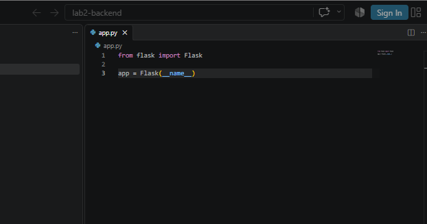

*Рисунок 1 - Начало работы с app.py*

Используются Python 3.14.2 и Flask 3.1.3. Команды PowerShell из папки проекта:

```powershell
python -m venv venv
.\venv\Scripts\python.exe -m pip install Flask==3.1.3
.\venv\Scripts\python.exe app.py
```

Сервер запускается на порту 3000. Параметр `debug=True` включает режим отладки и автоматический перезапуск при изменении сохранённого файла.

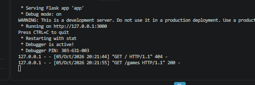

*Рисунок 2 - Запуск сервера и успешный запрос GET /games*

В терминале видны сообщения `Debug mode: on`, `Restarting with stat` и ответ 200 для `GET /games`. Запрос корневого адреса `/` возвращает 404, поскольку такой маршрут не задан.

## Индивидуальное задание

Для варианта 12 используется сущность «Игры». Поля базового уровня: `id`, `title`, `genre`. На среднем уровне добавлены `platform` и `rating`.

### Код сервера

[Файл app.py](app.py)

```python
from flask import Flask,jsonify,request

app = Flask(__name__)
games = [
    {"id": 1, "title": "Minecraft", "genre": "Sandbox", "platform": "PC", "rating": 9.0},
    {"id": 2, "title": "Portal 2", "genre": "Puzzle", "platform": "PC", "rating": 9.5},
    {"id": 3, "title": "God of War", "genre": "Action", "platform": "PlayStation", "rating": 9.1}
]
next_id = 4

@app.route('/games', methods=['GET'])
def get_games():
    return jsonify({
        "count": len(games),
        "games": games
    })
@app.route('/games/<int:game_id>', methods=['GET'])
def get_game(game_id):
    for game in games:
        if game["id"] == game_id:
            return jsonify(game)

    return jsonify({"error": "Игра не найдена"}), 404
def validate_game(data):
    if not isinstance(data, dict):
        return "Нужно передать JSON-объект"

    for field in ("title", "genre", "platform"):
        value = data.get(field)
        if not isinstance(value, str) or not value.strip():
            return f"Поле {field} должно быть непустой строкой"

    rating = data.get("rating")
    if type(rating) not in (int, float) or not 0 <= rating <= 10:
        return "Рейтинг должен быть числом от 0 до 10"
    return None


@app.route('/games', methods=['POST'])
def create_game():
    global next_id
    data = request.get_json(silent=True)
    error = validate_game(data)

    if error is not None:
        return jsonify({"error": error}), 400

    game = {
        "id": next_id,
        "title": data["title"].strip(),
        "genre": data["genre"].strip(),
        "platform": data["platform"].strip(),
        "rating": data["rating"]
    }
    games.append(game)
    next_id += 1

    return jsonify(game), 201


if __name__ == '__main__':
    app.run(port=3000, debug=True)
```

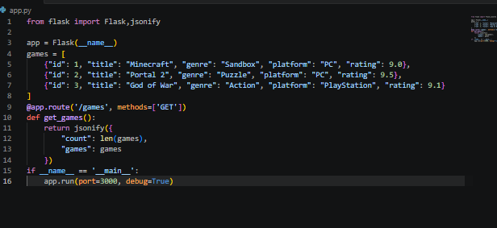

*Рисунок 3 - Начальные данные и обработчик GET /games в app.py*

### Получение списка игр

Обработчик `GET /games` возвращает количество записей и список игр. Начальные данные содержат Minecraft, Portal 2 и God of War.

Проверка в браузере:

```text
http://127.0.0.1:3000/games
```

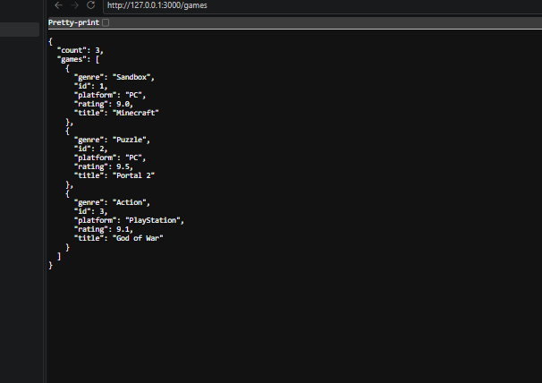

*Рисунок 4 - JSON-ответ GET /games: count равен 3*

### Получение игры по ID

Маршрут `GET /games/<int:game_id>` принимает числовой ID и ищет игру в списке. При совпадении возвращается игра, при отсутствии записи - JSON с сообщением «Игра не найдена» и статусом 404.

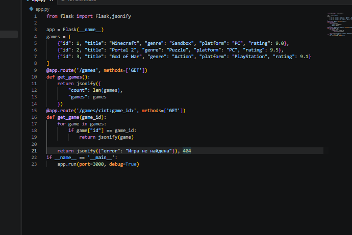

*Рисунок 5 - Обработчик получения игры по ID*

Проверены запросы `GET /games/2` и `GET /games/999`. Первый возвращает Portal 2 со статусом 200, второй - сообщение об отсутствии игры со статусом 404.

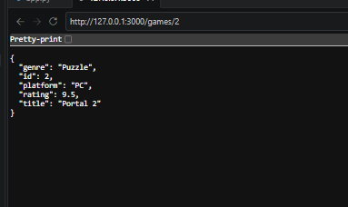

*Рисунок 6 - Получение игры с ID 2*

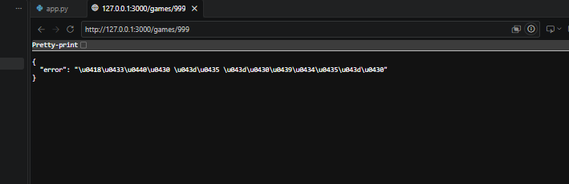

*Рисунок 7 - Сообщение об отсутствии игры с ID 999*

Во втором ответе русские буквы записаны как последовательности `\uXXXX`. Это допустимое представление символов в JSON; сообщение означает «Игра не найдена».

### Проверка текстовых полей

Добавлена функция `validate_game(data)`. Она проверяет, что данные являются словарём, а поля `title`, `genre` и `platform` содержат непустые строки. Если обнаружена ошибка, функция возвращает её описание. Значение `None` означает, что эти проверки пройдены.

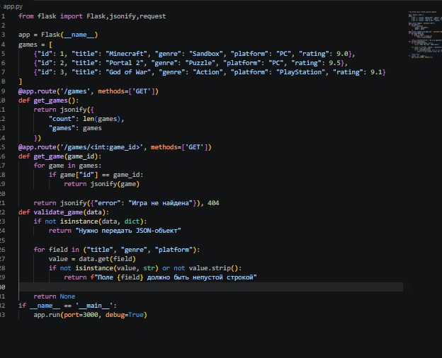

*Рисунок 8 - Проверка формата данных и текстовых полей*

### Проверка рейтинга

После проверки текстовых полей функция проверяет `rating`. Допускаются целые и дробные числа от 0 до 10. Строка с числом, логическое значение, отсутствующее поле и число вне диапазона возвращают сообщение об ошибке.

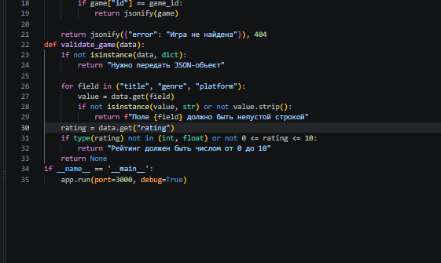

*Рисунок 9 - Проверка типа и диапазона рейтинга*

Проверка функции на примерах подтвердила, что корректная игра с рейтингом 9.5 проходит, а неверный рейтинг, пропущенное текстовое поле и данные в виде списка отклоняются.

### Проверка функции в Python

Функция импортирована командой `from app import validate_game` в отдельном терминале Python. Для игры Hades с рейтингом 9.5 функция вернула `None`. После изменения рейтинга на 11 вернулось сообщение «Рейтинг должен быть числом от 0 до 10».

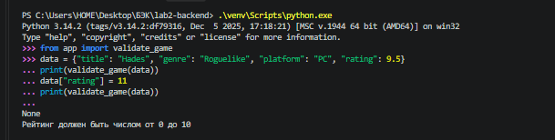

*Рисунок 10 - Проверка корректных данных и рейтинга вне диапазона*

Затем рейтинг возвращён к значению 9.5, а название заменено строкой из пробелов. Функция вернула сообщение «Поле title должно быть непустой строкой».

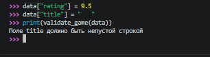

*Рисунок 11 - Отклонение пустого названия игры*

### Проверка данных POST-запроса

При первоначальной проверке обработчик `POST /games` читал JSON из тела запроса и вызывал `validate_game`. При ошибке возвращался JSON с её описанием и статусом 400. Корректные данные возвращались обратно со статусом 200 без записи в список игр. Далее обработчик дополнен созданием записи.

Проверены ответы работающего сервера: корректная игра получает статус 200, а рейтинг 11 - статус 400. Отдельно проверены пустое название, неверный тип рейтинга и некорректный JSON. Маршруты GET продолжают работать.

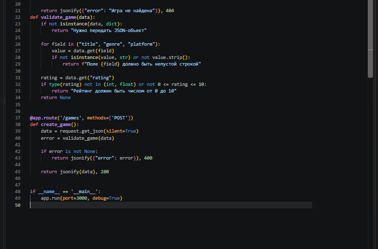

*Рисунок 12 - Чтение JSON, проверка данных и формирование ответа POST*

При отправке запроса из Postman без доступного обработчику JSON-объекта получен статус 400 Bad Request и сообщение «Нужно передать JSON-объект».

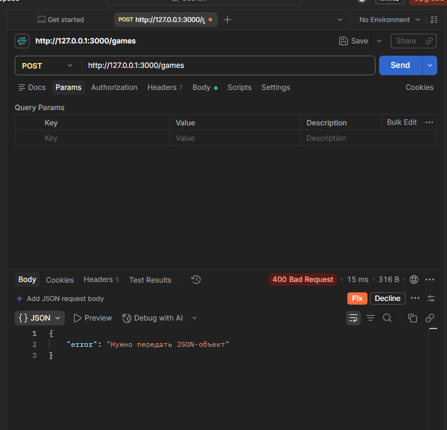

*Рисунок 13 - Ответ 400 при неполучении JSON-объекта*

В Postman выбраны `Body`, `raw` и формат JSON. Переданы данные игры Hades с рейтингом 9.5. Сервер вернул эти данные со статусом 200 OK.

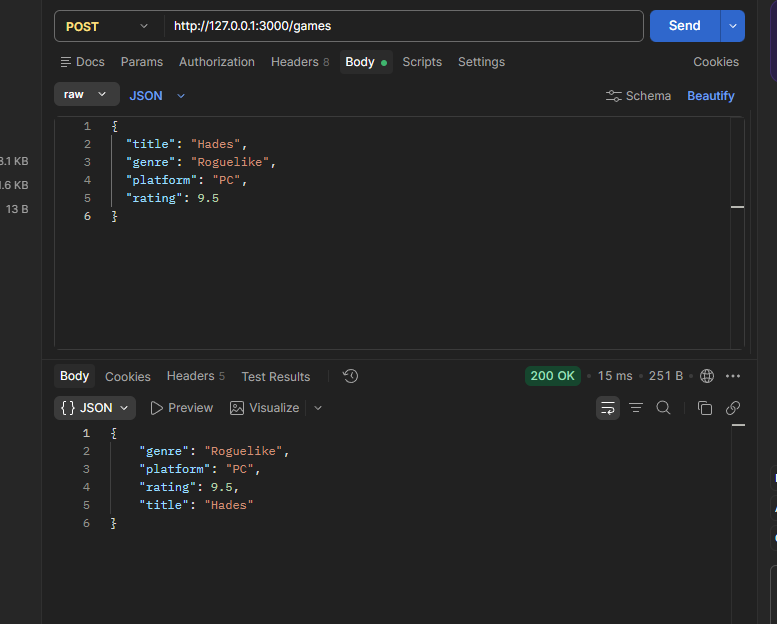

*Рисунок 14 - Успешная проверка данных POST-запроса*

В том же запросе рейтинг заменён на 11. Сервер вернул статус 400 Bad Request и сообщение «Рейтинг должен быть числом от 0 до 10».

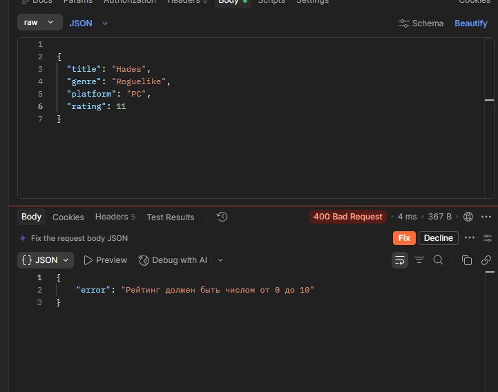

*Рисунок 15 - Проверка диапазона рейтинга через POST-запрос*

### Подготовка ID новой игры

После списка начальных игр добавлена переменная `next_id = 4`. Первые три номера уже заняты. Счётчик будет использоваться при создании новой игры и увеличиваться после добавления записи.

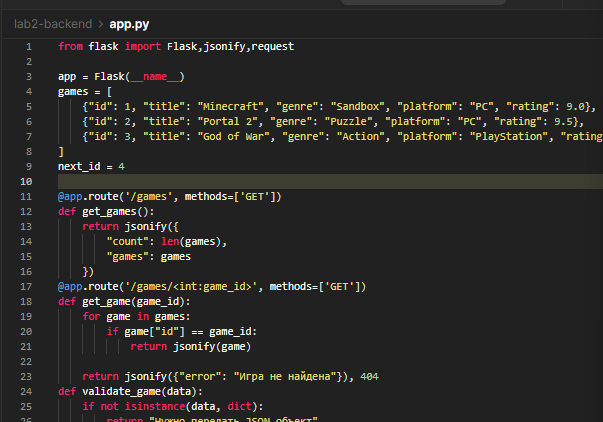

*Рисунок 16 - Подготовка номера следующей игры*

### Создание новой игры

Обработчик `POST /games` дополнен созданием словаря игры. ID назначается из `next_id`, пробелы по краям текстовых полей удаляются. После проверки запись добавляется в `games`, счётчик увеличивается на один, а созданная игра возвращается со статусом 201 Created.

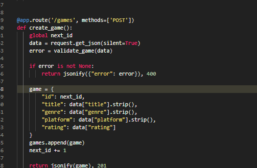

*Рисунок 17 - Добавление игры в список и ответ 201*

Проверка в отдельном экземпляре приложения подтвердила создание игры с ID 4, получение её через GET и увеличение количества записей до четырёх. Запрос с рейтингом 11 возвращает 400 без добавления записи. Следующий корректный запрос получает ID 5.

При отправке корректного JSON из Postman сервер вернул 201 Created и данные созданной игры Hades с ID 4.

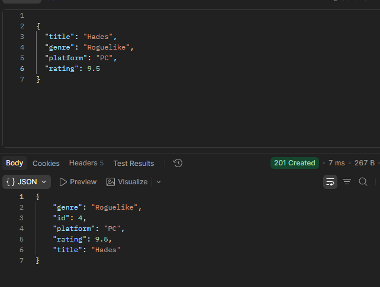

*Рисунок 18 - Ответ 201 Created с ID созданной игры*

После создания выполнен `GET /games/4` в Postman. Сервер вернул 200 OK и данные Hades с ID 4, платформой PC и рейтингом 9.5.

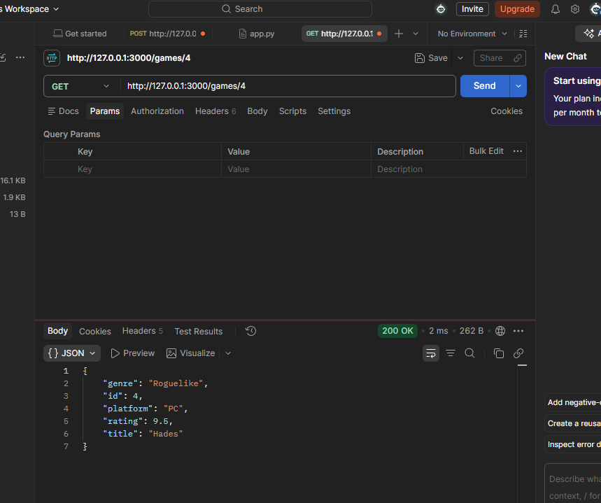

*Рисунок 19 - Получение игры после добавления через POST*

### Следующие этапы

Обновление, удаление, поиск, сортировка и пагинация будут добавлены по мере выполнения работы.

## Ответы на контрольные вопросы

### 1. В чём разница между PUT и PATCH?

PUT используется для полной замены данных ресурса, PATCH - для изменения отдельных полей. В среднем уровне этой работы нужен PUT.

### 2. Как реализовать поиск по коллекции?

Получить параметр `search` из `request.args` и выбрать игры, названия которых содержат переданную строку.

### 3. Как реализовать сортировку по полю?

Проверить, что указанное поле разрешено, затем отсортировать записи по его значению. Параметр `order` задаёт порядок: `asc` или `desc`.

### 4. Как работает пагинация?

Коллекция разбивается на страницы. Для страницы `page` с размером `limit` первый индекс равен `(page - 1) * limit`. В ответ попадают записи выбранной страницы.

### 5. Какой код возвращается при ошибке валидации?

HTTP 400 Bad Request. В JSON-ответе следует указать, какие данные переданы неверно.

## Источники

1. Лабораторная работа №2 «HTTP-методы: обработка GET, POST, PUT, DELETE»: средний уровень и вариант 12.
2. [Flask: Quickstart](https://flask.palletsprojects.com/en/stable/quickstart/).
3. [Postman: отправка запросов](https://learning.postman.com/docs/sending-requests/requests/).
